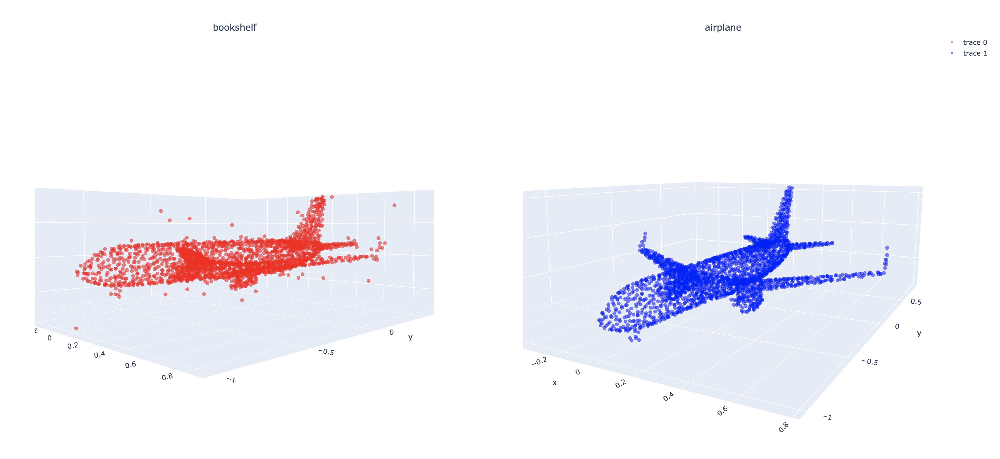

# Pointnet-CW-attack
This is a revised code of <a href="https://arxiv.org/abs/1612.00593">Pointnet</a> and the <a href = "https://arxiv.org/abs/1608.04644">C&W attack</a>. This implementation of Pointnet reaches accuracy of 88.2% in classification task on Modelnet40 dataset. the parameters of the model are all similar to the parameters used in the original implementation.

 
you can see an example of the attack in the following figure.

 

